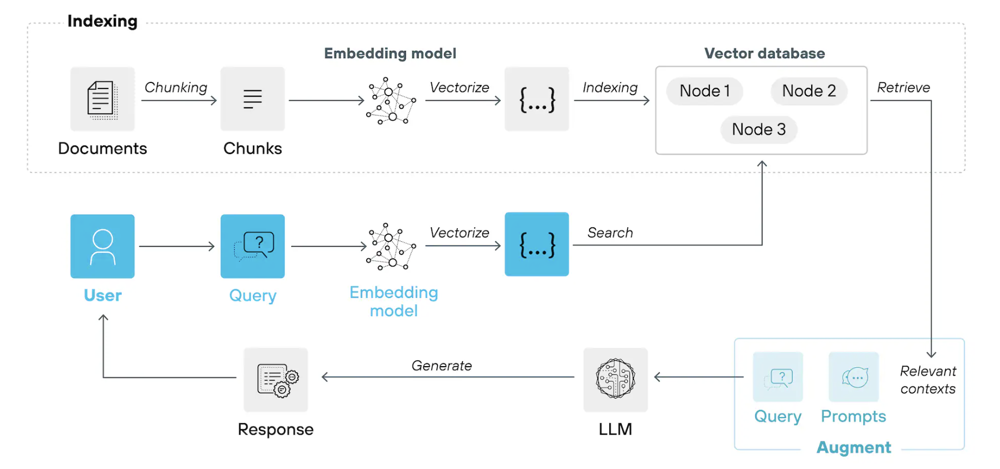

# Basic RAG example
This project is a simple implementation of a RAG architecture using data from a FAQ document (in Spanish). It uses ChromaDB for storing embeddings, [`jaimevera1107/all-MiniLM-L6-v2-similarity-es`](https://huggingface.co/jaimevera1107/all-MiniLM-L6-v2-similarity-es) as embedding model, and OpenAI API for generating answers to user queries.

## What is a RAG architecture
A RAG architecture is a system based on LLMs. Its goal is to augment LLMs with specific information so that they can answer queries about specific information (avoiding hallucinations). More specifically, documents (information) is stored as embeddings in a vector database and an LLM is used to generate answers to queries.

This architecture consists of two pipelines: one for ingesting (indexing) the documents and a second one for answering user queries. 

*RAG architecture. Source: [What Is Retrieval-Augmented Generation (RAG)? An Overview](https://www.paloaltonetworks.com/cyberpedia/what-is-retrieval-augmented-generation)*

## How to set up the project
Before getting started, make sure you have [uv](https://docs.astral.sh/uv/getting-started/installation/) installed on your local system.

To use the existing project set up, perform the following steps:
1. Run `uv init`.
2. Run `uv add -r requirements.txt`.
3. Create `.env` file and place the OpenAI API key as variable: `OPENAI_API_KEY=`.

## How to run the project
You can either run the full rag system or test specific components of the indexing and rag pipelines.

## Running the full rag system
To run the full rag system:

1. Run the indexing pipeline: `uv run ingest_documents.py`.
2. Run the rag pipeline: `uv run run_rag_pipeline.py`. In the main section of the script, modify the defintion of `query` to test different queries.

### Testing different components of the RAG architecture
To test specific component of this project, you can run the following scripts as `uv run file.py`:

- `test_create_embeddings.py`: Tests the embedding model and runs similarity tests on some embedding examples.
- `test_search.py`: Tests searching through the vector database to find similar documents to queries.
- `test_answer_generation.py`: Tests generating the answer to a simple querying using the OpenAI API. 
